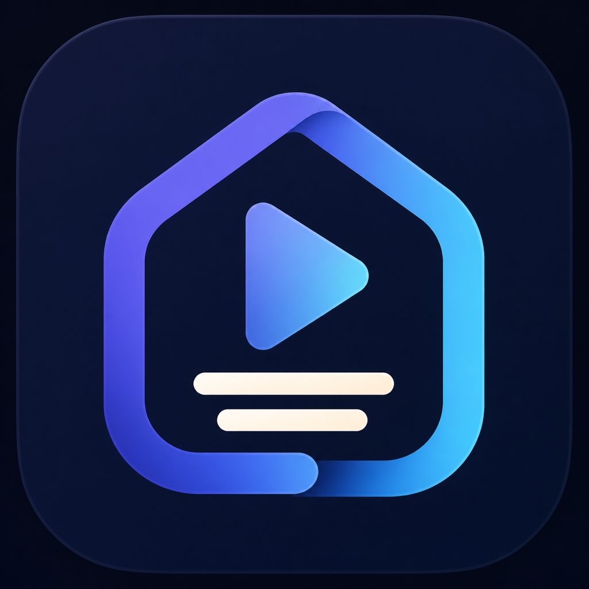

<p align="center">
  
</p>

<h1 align="center">LocalSub</h1>

<p align="center">
  Privacy-first Japanese subtitles for video, built for Apple Silicon.
</p>

<p align="center">
  
  
  
  
  <a href="../LICENSE"></a>
</p>

<p align="center">
  <a href="../README.md">日本語</a> ·
  <a href="#build-and-test">Build</a> ·
  <a href="architecture/software-design.md">Architecture</a> ·
  <a href="security/threat-model.md">Threat model</a> ·
  <a href="../CONTRIBUTING.md">Contributing</a> ·
  <a href="../GOVERNANCE.md">Governance</a> ·
  <a href="../SECURITY.md">Security</a> ·
  <a href="../LICENSE">License</a>
</p>

LocalSub is a macOS desktop application that turns Japanese or English speech in a video
into editable Japanese captions and exports a new captioned video.

The product is intentionally local-first. Its first supported product slice targets
Apple Silicon Macs running macOS 26 or later and accepts SDR MP4/MOV files that
AVFoundation can decode.

> [!IMPORTANT]
> LocalSub is under active development. The repository does not yet publish an official signed
> binary release. Local builds are for development and dogfooding.

## Repository layout

- `Sources/LocalSubCore`: deterministic domain logic and provider contracts
- `Sources/LocalSubApple`: Apple Speech, Translation, and AVFoundation adapters
- `Sources/LocalSubCloud`: optional bounded GPT-5.6 Luna text translation adapter
- `Sources/LocalSubCLI`: developer and dogfooding CLI
- `Sources/LocalSubApp`: SwiftUI desktop application
- `Tests`: TDD unit and integration tests
- `docs/architecture`: design and architecture decisions
- `docs/security`: repository threat model
- `docs/qa`: dogfooding inventory and manual verification assets

See [software-design.md](architecture/software-design.md) for the authoritative design.

## Build and test

LocalSub requires Apple Silicon, macOS 26, and Xcode 26 or later.

```bash
swift test --scratch-path /tmp/localsub-tests
./scripts/build-app.sh
open .build/app/LocalSub.app
```

The build script produces an ad-hoc signed, sandboxed local dogfood app. A distributable desktop
app additionally requires Developer ID signing, Hardened Runtime, notarization, and
stapling; ad-hoc builds are intentionally rejected by Gatekeeper assessment. Release owners
use `scripts/build-release.sh`, which fails closed unless the signing identity and notarytool
keychain profile are provided, and ends with `stapler validate` plus `spctl --assess`.

See [Distribution](distribution.md) for Apple Developer Program, Developer ID, notarization,
Mac App Store, and release credential requirements.

## Developer CLI

### Install

```bash
brew install byteflare-co/tap/localsub
localsub doctor
```

Without Homebrew:

```bash
curl -fsSLO https://github.com/byteflare-co/localsub/releases/download/v0.1.0-alpha.1/install.sh
less install.sh
sh install.sh
~/.local/bin/localsub doctor
```

GitHub does not include prereleases in `releases/latest`, so this URL is pinned to an exact version.
The CLI verifies a pinned source archive and builds it locally. It does not require an Apple
Developer Program membership, but does require Xcode 26 or later. LocalSub CLI
supports Apple Silicon and macOS 26 or later. See
[CLI distribution and release](cli-distribution.md) for model preparation, installer controls,
and the release process.

### Usage

```bash
swift run --scratch-path /tmp/localsub-cli localsub input.mp4 \
  --output captioned.mp4 --language japanese
```

Run `localsub doctor` before the first video. If the Speech model is missing, review the disclosure
and run `localsub setup --language japanese --accept-model-download` to prepare it.

At startup, the CLI checks GitHub Releases at most once every 24 hours and only prints a notice
when a newer version exists. It sends no video, audio, captions, paths, or filenames and never
installs an update automatically. Set `LOCALSUB_NO_UPDATE_CHECK=1` to disable the request.

Use `--language english` for English speech. Apple Translation is the default and only uses
already installed models. `--translation luna` explicitly selects GPT-5.6 Luna and requires an
`OPENAI_API_KEY` injected into that process; `--glossary terms.txt` accepts up to 32 KiB of
`source=日本語` entries. Luna CLI runs also require `--acknowledge-luna-data-transfer` after reading
the disclosure printed by the command. Never commit the key. Progress is emitted as one JSON object
per line on standard error.

The Desktop app can store its OpenAI key in the local, non-synchronizing macOS Keychain. Luna
mode asks for confirmation on every generation and sends only the on-device English transcript
units and glossary—not video, audio, paths, or filenames. Requests set `store: false` to avoid
default Response-object storage. Unless the API organization/project has applicable data controls,
OpenAI documents separate abuse-monitoring retention of up to 30 days and encrypted prompt caching
of up to 24 hours. Apple Translation remains available for an entirely local translation path.

The desktop app supports editable two-line cues, burned-in MP4 output, and a separate UTF-8
SRT save action. MP4 export asks for a destination folder so the sandbox can safely stage and
atomically publish the fixed output filename. Existing output files are not silently replaced.

## Contributing and support

Contributions are welcome. Read [CONTRIBUTING.md](../CONTRIBUTING.md) before opening a pull request,
use the structured issue templates for bugs and features, and follow the
[Code of Conduct](../CODE_OF_CONDUCT.md). Project decision-making is described in
[GOVERNANCE.md](../GOVERNANCE.md). For support boundaries, see [SUPPORT.md](../SUPPORT.md).

Report vulnerabilities privately as described in [SECURITY.md](../SECURITY.md); never attach private
media, transcripts, credentials, or signing materials to a public issue.

## License

LocalSub is licensed under the [Apache License 2.0](../LICENSE). Copyright 2026 株式会社Byteflare.
Commercial use, modification, and redistribution are permitted subject to the license terms.
The license does not grant rights to the LocalSub or 株式会社Byteflare names or branding beyond
reasonable attribution.
