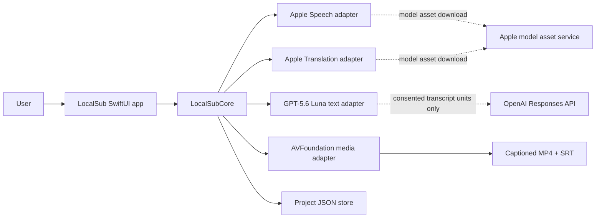
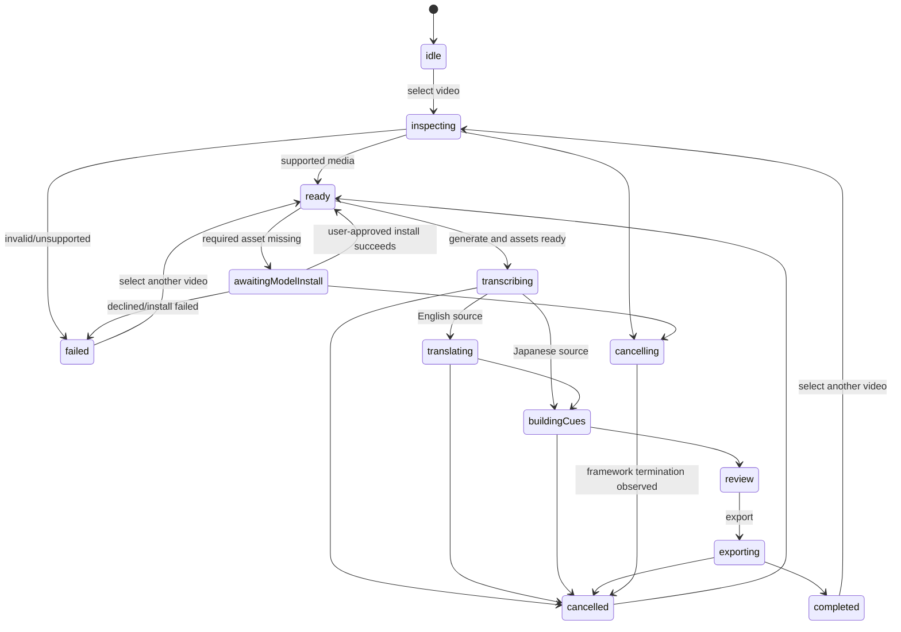

# LocalSub software design

Status: design baseline

## 1. Product contract

LocalSub is a single-user macOS desktop application. A user selects a local video,
chooses the spoken language, generates Japanese captions, edits the result in a
time-indexed preview, and exports both a captioned MP4 and an SRT sidecar.

### Initial supported slice

- Apple Silicon, macOS 26 or later.
- SDR MP4/MOV inputs that AVFoundation reports as readable and playable.
- Japanese speech to Japanese captions.
- English speech to Japanese captions using Apple Translation by default, or optional GPT-5.6
  Luna text translation after explicit disclosure.
- One video job at a time.
- Burned-in MP4 and UTF-8 SRT outputs.
- Media and speech recognition remain local. Apple frameworks may download model assets.
  Luna mode sends only English transcript units and a glossary to OpenAI under ADR-006;
  video/audio bytes and paths are never sent.

### Explicitly out of scope for v1

- WebM and arbitrary codecs; HDR/Dolby Vision preservation.
- Cloud ASR, automatic web research, or cloud providers other than the bounded Luna adapter.
- Speaker diarization, karaoke highlighting, and per-cue animated positioning.
- Automatic face/OCR avoidance.
- Accounts, collaboration, telemetry, and cloud storage.
- App Store distribution. The first dogfood build is Developer ID/local development.

## 2. Quality attributes

1. **Correctness:** source spans, translations, display cues, and render settings are
   separate records. Generated media is never treated as the editable source of truth.
2. **Privacy:** audio/video content stays on device. Luna is explicit opt-in text processing;
   logs contain identifiers and timing, not transcript text or credentials.
3. **Security:** all selected media is attacker-controlled. No shell command construction,
   no in-place overwrite, bounded resource use, validated output destinations, and atomic
   publication are mandatory.
4. **Stability:** jobs are cancellable, state transitions are explicit, partial exports
   remain in a private temporary directory, and UI work never blocks the main actor.
5. **Maintainability:** deterministic core logic has no Apple framework dependency.
   ASR, translation, media inspection, rendering, and persistence are protocols.
6. **Reproducibility:** a project records provider identity, OS build, application schema
   version, caption policy, and render profile. Apple model weights may still change with
   OS updates, so exact ASR reproduction is not guaranteed.
7. **Containment:** dogfood and release app bundles use App Sandbox, Hardened Runtime,
   least-privilege user-selected file entitlements, Developer ID signing, notarization,
   and stapling. The CLI is distributed separately as SHA-256-pinned source and built locally
   through Homebrew or the verified installer; no CLI executable, bottle, or Cask is shipped.

## 3. System context



The application owns orchestration and presentation. Core owns invariants and state
transitions. Adapters own framework-specific conversion but cannot mutate project state
directly.

## 4. Module boundaries

### LocalSubCore

- `CaptionProject`, `SourceSpan`, `TranslationUnit`, `DisplayCue`, `RenderProfile`.
- Project validation and versioned JSON persistence contracts.
- `CueBuilder`: converts timed spans or translations to readable Japanese cues.
- SRT serialization.
- Job state machine and typed domain errors.
- Provider protocols.

It does not import SwiftUI, Speech, Translation, AVFoundation, or AppKit.

### LocalSubApple

- `AppleSpeechTranscriber`: time-indexed transcription when runtime capabilities allow.
- `AppleTranslationProvider`: English-to-Japanese batch translation.
- `AVFoundationMediaInspector`: validates streams, duration, dimensions, rotation, and SDR.
- `AVFoundationCaptionRenderer`: composites caption layers and publishes an MP4 atomically.
- Runtime capability probing and Apple-managed asset preparation.
- Non-synchronizing Keychain storage for the Desktop OpenAI credential.

### LocalSubCloud

- Fixed-host Responses API adapter for exact model `gpt-5.6-luna`.
- Strict schema, prompt-injection boundary, input/batch/deadline/streaming-response limits.
- No media framework imports, tool calls, retries, telemetry, or silent provider fallback.

### LocalSubCLI

Used for repeatable spikes, fixtures, batch comparison, and dogfooding. It calls the same
application service as the GUI and has no privileged bypass. It can use an already-installed
Translation model but cannot request first-use model-download consent. Missing assets are a
typed, noninteractive failure that directs the developer to prepare them in the GUI.

### LocalSubApp

- File selection/drop and security-scoped access lifetime.
- Job progress, cancellation, preview, editing, and export destination selection.
- User-readable capability and validation failures.
- No domain decisions beyond invoking use cases.
- Owns first-use Translation model preparation through SwiftUI `translationTask`, because
  the programmatic Translation session can only use already-installed language assets.
- Owns balanced, job-scoped access to security-scoped input, project, and destination URLs.

## 5. Provider contracts

```swift
public protocol TranscriptionProvider: Sendable {
    var descriptor: ProviderDescriptor { get }
    func capabilities(for locale: LocaleIdentifier) async -> ProviderCapabilities
    func transcribe(_ request: TranscriptionRequest) async throws -> [ProviderTranscriptSpan]
}

public protocol TranslationProvider: Sendable {
    func availability(from: LanguageCode, to: LanguageCode) async -> ProviderAvailability
    func translate(_ units: [TranslationRequest]) async throws -> [TranslationResponse]
}

public protocol CaptionRenderer: Sendable {
    func render(_ request: RenderRequest) -> AsyncThrowingStream<RenderEvent, Error>
}
```

Provider outputs are untrusted until core validation succeeds. IDs are generated by core,
not accepted from provider text. Translation results are correlated by opaque request IDs;
array order alone is insufficient.

`ProviderTranscriptSpan` and `TranslationResponse` are adapter DTOs without canonical entity
IDs. Core validates them and creates `SourceSpan` and `TranslationUnit`. Translation response
IDs must form an exact one-to-one set with request IDs; duplicate, missing, unknown, empty, or
late-generation responses fail the batch without destroying the previous valid translation.
All cross-actor DTOs are `Sendable` and use `RationalTime`, never CoreMedia or UI objects.

Provider cancellation is an explicit implementation obligation. Adapters wrap work in
`withTaskCancellationHandler` and invoke the framework stop primitive (`SpeechAnalyzer`
cancel/finish, `TranslationSession.cancel`, `AVAssetReader.cancelReading`, or export cancel).
Task cancellation alone is not considered completion.

## 6. Canonical project model

The JSON project file is the editable source of truth.

```text
CaptionProject
├── media: fingerprint, bookmark reference, display size, duration, orientation
├── provenance: app version, OS build, provider descriptor, created time
├── sourceSpans: source text + CMTime-compatible interval + confidence
├── translations: source span IDs + translated text + edit provenance
├── displayCues: final text + interval + explicit line breaks + optional placement
└── renderProfile: canvas, font, safe margins, colors, renderer version
```

Invariants:

- All time values are integer rational time (`value` and `timescale`), never persisted as
  binary floating point.
- Intervals are non-negative, ordered, and bounded by media duration.
- Display cues do not overlap in v1 and contain one or two non-empty lines.
- Cue text is valid Unicode, contains no control characters other than an intentional
  line feed, and is subject to a configurable scalar limit.
- Translation units reference existing source spans.
- Project decoding rejects unsupported future schema versions.
- Source media is referenced by fingerprint and user-granted URL; it is not copied into
  the project JSON.
- `RationalTime` construction requires `timescale > 0`, checked arithmetic, normalized
  finite ranges, and overflow rejection.
- A persisted `MediaReference` contains opaque security-scoped bookmark data, a display-only
  original path, resource identifier, volume identifier, byte size, modification time, and
  fingerprint algorithm version. Stale or mismatched bookmarks stop processing and require
  user reselection; path text is never authority.
- Imported project files are preflighted before JSON decoding: 16 MiB maximum, supported
  schema envelope, bounded collection counts, bounded aggregate text and reference edges,
  followed by full domain validation. Decoder allocation is not the first size check.

## 7. Pipeline and state machine



The implementation maintains an event-by-state transition table as the source of truth;
unlisted transitions are typed errors. Every operation holds a `JobLease(jobID, generation)`.
Provider result acceptance, autosave, cleanup, export validation, and publication recheck that
the lease is active and non-cancelled. Cancel completes only after the framework operation is
terminated, handles are closed, and publication has been made impossible. A failed stage can
retry the same stage while retaining only the last validated upstream revision.

## 8. Caption segmentation

Cue generation is deterministic and tested independently of ASR.

1. Normalize whitespace without rewriting lexical content.
2. Establish candidate breaks from source-span boundaries, punctuation, and silence gaps.
3. For Japanese, prefer punctuation and kinsoku-safe character boundaries.
4. Use display-width units: full-width characters count as 1; ASCII-like narrow glyphs
   count as 0.5 for the initial heuristic.
5. Target at most two lines and a configurable width (default 16 units per line).
6. Enforce minimum/maximum duration (default 0.833 to 7 seconds) where source timing
   permits; never fabricate time beyond the media duration.
7. Compute reading-speed warnings rather than silently deleting or paraphrasing text.
8. Translation may merge adjacent source spans or split a display cue, but the source
   mapping remains explicit.

BudouX is not a v1 runtime dependency. A Swift-native phrase segmenter can be added behind
`JapaneseBreakSuggesting` after it beats the deterministic baseline on fixtures.

SRT is explicitly lossy. Rational times are rounded to the nearest millisecond using a
documented half-away-from-zero rule, then adjusted to retain positive non-overlapping events.
Round-trip tests allow one millisecond timing error and require exact normalized text, not
project-object identity.

## 9. Caption layout

Render coordinates are normalized and converted only after the video's preferred transform
has established the display canvas.

- Landscape default: bottom center, 7-9% bottom margin, 80-86% maximum width.
- Portrait default: lower-middle, approximately 18-25% bottom margin.
- Square default: bottom center with 10% bottom margin.
- Default style: bundled redistributable Japanese sans font, white text, black outline,
  no animation, maximum two lines.
- Font size is derived from display height and clamped. `CaptionLayoutEngine` resolves the
  bundled font and emits CoreText-backed drawing commands (canvas, baselines, glyph bounds,
  colors, and safe area). Preview and export rasterize the same commands; SwiftUI `Text` is
  not used as a second caption renderer.
- Per-cue position is editable but automatic per-cue movement is out of scope.

## 10. Media processing and export

AVFoundation is the v1 media boundary.

1. Inspect with asynchronous `AVAsset` property loading.
2. Evaluate a versioned `MediaSupportPolicy` before transcription. v1 allows one H.264 or
   HEVC SDR video track and AAC/PCM audio in MP4/MOV, and rejects unsupported profiles,
   pixel formats, color transfer functions, track counts, audio layouts, frame rates,
   metadata volume, excessive duration/frame count/dimensions, or ambiguous inspection.
3. Decode audio through an `AVAssetReader`; do not load the full track into memory.
4. Render text with CoreText/CALayer into an `AVVideoComposition` using the display-space
   transform.
5. Export to a unique private temporary URL for computation, then copy/validate into an
   `itemReplacementDirectory` on the destination volume before publication.
6. Validate the exported asset's readability, video/audio presence, duration tolerance,
   and dimensions.
7. Publish only from the destination-volume staging file. For replacement, use coordinated
   replacement after rechecking the save-panel-approved resource identifier. For new files,
   reserve a regular-file destination without following symlinks. Recheck volume, resource
   identity, regular-file status, source inequality, active lease, and cancellation immediately
   before publication. Cross-volume `moveItem` is never described as atomic.

FFmpeg is a future isolated media adapter for broader format support. If added, it must be
invoked with `Process.executableURL` and argument arrays, never a shell; its LGPL/GPL build
configuration and notices become release-gating artifacts.

## 11. Persistence, temporary data, and logging

- Project writes use encode-to-temp, fsync-equivalent close, and atomic replacement.
- Autosave is debounced and records an edit revision to prevent stale writes.
- Temporary job directories are random, private, and deleted after success/cancellation;
  stale private directories are deleted automatically at launch according to a short fixed
  retention policy. Recovery retention is opt-in and visible to the user.
- Export never overwrites the source video.
- Logs redact URLs, filenames, transcript text, and translations by default.
- Diagnostic export requires explicit user action and clearly lists included content.
- No analytics or crash upload is included in v1.
- Apple Translation may collect bundle ID, source/target language, and API usage/performance
  metadata without content. The privacy notice states this accurately.

## 12. Error and recovery model

Errors are typed and user-actionable: unsupported OS/device/locale, model asset required,
model download failure, unsupported media, missing audio, insufficient disk, transcription
failure, translation failure, invalid cue, export failure, cancellation, and project
version mismatch.

The original media and last valid project revision remain untouched. A failed export can be
retried without retranscription. Translation can be retried without discarding source spans.

## 13. Concurrency and resource limits

- A single `JobCoordinator` actor owns the active job.
- CPU/media work is off the main actor; observable state projection occurs on `MainActor`.
- Structured tasks propagate cancellation into providers and rendering.
- Initial limits: one job, two-hour duration, 4K display dimension ceiling, 60 fps,
  bounded total frames and tracks, 8-channel/192 kHz audio ceiling, 20 GiB input,
  10,000 spans, 10,000 cues, 512 Unicode scalars per cue, bounded translation batch bytes,
  estimated output bytes plus safety margin, and a progress watchdog per expensive stage.
- Limits are centralized in `ResourcePolicy`, surfaced before work begins, and covered by
  boundary tests.

## 14. Testing strategy

TDD proceeds outside-in by deterministic seams.

1. Domain invariants and rational-time arithmetic.
2. Cue building, Japanese width, kinsoku rules, reading-speed warnings.
3. Project JSON migrations and atomic persistence.
4. Job state transitions, cancellation, stale callback rejection.
5. Fake-provider application-service integration tests.
6. SRT serialization and parser round-trips.
7. AVFoundation fixture inspection and rendering tests.
8. Runtime capability spikes for Apple Speech and Translation.
9. SwiftUI view-model tests and manual desktop dogfooding.

Test infrastructure injects `Clock`, `IDGenerator`, `ProjectStore`, `MediaInspector`,
`OutputPublisher`, stoppable providers, and a temporary filesystem. Fixtures have a manifest
containing generation recipe, SHA-256, license, expected properties, and test tier. Runtime
model tests are opt-in and record environment observations rather than expecting golden text.
Translation contract tests cover reordered, duplicate, missing, unknown, empty, partially
failed, and cancellation-late responses. Rendering fixtures compare sampled frame regions and
metadata with tolerances across rotations and aspect ratios; media byte hashes are not oracles.

Tests never require downloading a model unless explicitly marked as dogfood/integration.

## 15. Release gates

- All unit and deterministic integration tests pass under Thread Sanitizer-compatible code.
- Release build succeeds with zero new warnings owned by the project.
- Threat model and security review have no unresolved critical/high finding.
- Input corpus demonstrates acceptable transcription and translation behavior; engine
  selection is recorded rather than assumed.
- Manual runbook is approved, executed, and contains durable evidence for output media.
- Third-party code, models, and fonts have recorded licenses and notices.
- App Sandbox and Hardened Runtime entitlements are least privilege; signing, notarization,
  stapling, entitlement diff, and `spctl` verification pass. Network client entitlement is
  absent unless an approved ADR proves it necessary for Apple model preparation.
- Dependency revisions are pinned. Release artifacts include dependency/font hashes, notices,
  provenance, and an SBOM; unverified binary targets and branch dependencies are forbidden.
